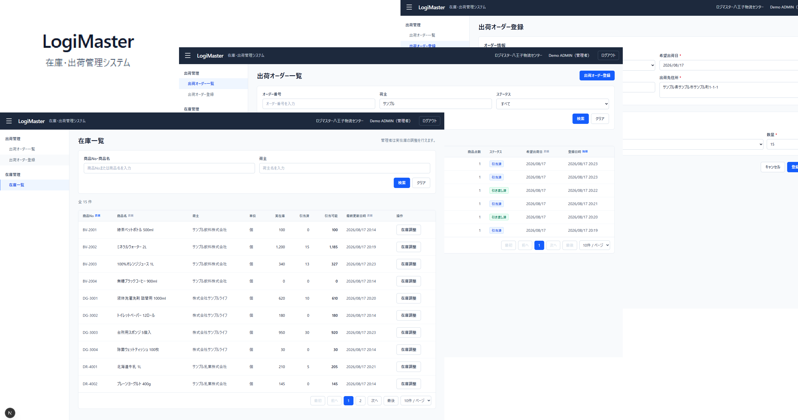

# LogiMaster - 在庫・出荷オーダー管理システム

複数の法人荷主から預かった商品を1つの物流センターで管理し、荷主から受けた出荷依頼を出荷オーダーとして登録・在庫引当し、後続の出荷工程へ引き渡すまでを対象とする業務システム。



---

## 主な機能

| 機能 | 内容 |
|---|---|
| Demo Login | OPERATOR / ADMIN を選択してログイン |
| 出荷オーダー一覧 | オーダー番号・荷主・ステータスでの絞り込み、ソート、ページング |
| 出荷オーダー登録 | 複数明細の登録、登録時の在庫引当 |
| 出荷オーダー詳細 | キャンセル、後続工程への引き渡し |
| 在庫一覧 | 実在庫・引当済・引当可能の表示、商品No/商品名・荷主での絞り込み |
| 在庫調整 | 実在庫の増減（ADMINのみ） |

---

## 技術スタック

| 区分 | 技術 |
|---|---|
| Monorepo | pnpm workspace |
| Frontend | Next.js 15 (App Router) / React 19 / TypeScript |
| Backend | NestJS 11 / TypeScript |
| Database | PostgreSQL 16 |
| ORM | Prisma 6 |
| Server State | TanStack Query 5 |
| Validation | Zod 4 |
| Styling | Tailwind CSS 4 |
| Test | Jest |
| Lint | ESLint (Flat Config) |
| Local Database | Docker Compose |

---

## アーキテクチャ

```text
apps/
├─ web/        # Next.js
└─ api/        # NestJS
packages/
└─ contracts/  # Next.js / NestJS間で共有するAPI契約
```

`apps/api` は業務単位でモジュールを分け、モジュール内を4層に分離する。

```text
apps/api/src/modules/<module>/
├─ domain/          # 業務ルール・エンティティ・Repositoryインターフェース
├─ application/     # ユースケース、トランザクション境界
├─ infrastructure/  # Prisma実装
└─ presentation/    # Controller
```

`apps/web` は画面を `src/app`、サーバー状態の取得・更新を `src/features` に置き、UIから直接APIを呼ばない。

---

## 設計・実装のポイント

- 出荷オーダー登録時に在庫を引き当てる。1商品でも不足する場合はオーダー全体を失敗させ、部分引当は行わない。
- 許可する状態遷移は `ALLOCATED → HANDED_OVER` と `ALLOCATED → CANCELLED` のみ。キャンセル時はAllocationを削除せず `releasedAt` を記録して引当済数量を戻す。
- 引当可能数は保存せず `onHandQuantity - allocatedQuantity` で算出する。在庫数量の不変条件はDBのCHECK制約でも担保する。
- Demo Loginで選択したユーザーの識別子をHTTPヘッダーでAPIへ送信し、サーバー側でUser・Organization・Roleを解決する。実在庫の調整はADMINのみで、画面での制御に加えNestJSのGuardでも拒否する。
- リクエスト・レスポンスの型とバリデーションは `packages/contracts` のZodスキーマをフロントエンド・バックエンドで共有する。

---

## 動作環境

- Node.js 20以上（動作確認は v24.15.0）
- pnpm 11以上
- Docker / Docker Compose

---

## セットアップ

```bash
cp apps/api/.env.example apps/api/.env
cp apps/web/.env.example apps/web/.env.local

pnpm run setup   # install / contractsビルド / Prisma Client生成
pnpm db:up       # PostgreSQL起動
pnpm db:migrate
pnpm db:seed

pnpm dev
```

| アプリ | URL |
|---|---|
| Web | http://localhost:3000 |
| API | http://localhost:3001/api |

ログイン画面のボタンからDemo User（OPERATOR / ADMIN）を選択する。

### 確認用コマンド

```bash
pnpm test        # Jest
pnpm typecheck   # 型チェック
pnpm lint        # ESLint
pnpm build       # contracts / api / web のビルド
```

---

## スコープ外

本認証（Cognito等）、MFA、入荷、ロケーション管理、ロット・賞味期限、ピッキング、梱包、出荷完了、配送・配車、請求、荷主向け画面、マスタCRUD画面。

---

## ドキュメント

| 文書 | 内容 |
|---|---|
| [設計原則](docs/01-design-principles.md) | レイヤー構成、業務ルールの配置、テスト方針 |
| [要件定義書](docs/02-requirements.md) | 業務要件、権限、画面、エラー |
| [設計書](docs/03-system-design.md) | ドメインモデル、DB設計、API契約、トランザクション設計 |
